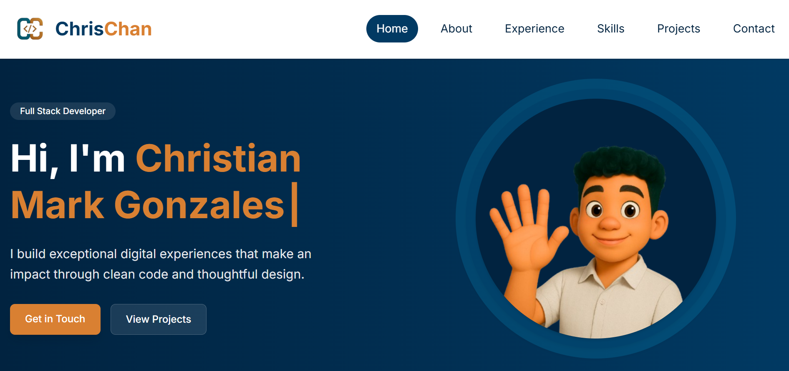

# Personal Portfolio - Christian Mark Gonzales


---

A modern, minimalistic personal portfolio website built with Vue 3, Vite, and Tailwind CSS.  
Showcasing my professional experience, skills, projects, and contact information — fully responsive and deployed on GitHub Pages.

🔗 **Live Site:** [https://cmarkgonzales.github.io/my-portfolio/](https://cmarkgonzales.github.io/my-portfolio/)

---

## 📸 Screenshot



---

## 📖 About

This portfolio serves as my personal website to highlight:

- A brief introduction about myself
- Professional experience
- Technical skills
- Featured projects
- Contact information for networking or job opportunities

The site is built using modern frontend technologies with a focus on simplicity, performance, and maintainability.

---

## 🛠️ Tech Stack

| Technology    | Description                  |
| ------------- | ---------------------------- |
| [Vite](https://vitejs.dev/)         | Lightning-fast development tool |
| [Vue 3](https://vuejs.org/)         | Progressive JavaScript framework |
| [Tailwind CSS](https://tailwindcss.com/) | Utility-first CSS framework |
| Composition API | Modern Vue 3 state management |
| Static routing | Simple hash-based anchor links (`href="#section"`) |

---

## ✨ Features

- 💡 Vue 3 Composition API
- ⚡ Vite ultra-fast dev server & build
- 🎨 Tailwind CSS responsive design
- 🚀 Deployed via GitHub Pages
- 🧩 Component-based architecture
- 🔗 Static routing with anchor links (`href="#section"`)
- 📱 Mobile-first, fully responsive

---

## 📂 Project Structure

```bash
src/
  components/    # Core Vue components (NavBar, Home, About, Experience, Skills, Projects)
  constants/     # Data/constants used for rendering components
  utils/         # Utility components/functions shared across different components
  App.vue        # Root component rendering all sections
  main.js        # Application entry point

public/          # Public assets served directly
screenshots/     # Screenshots for README
