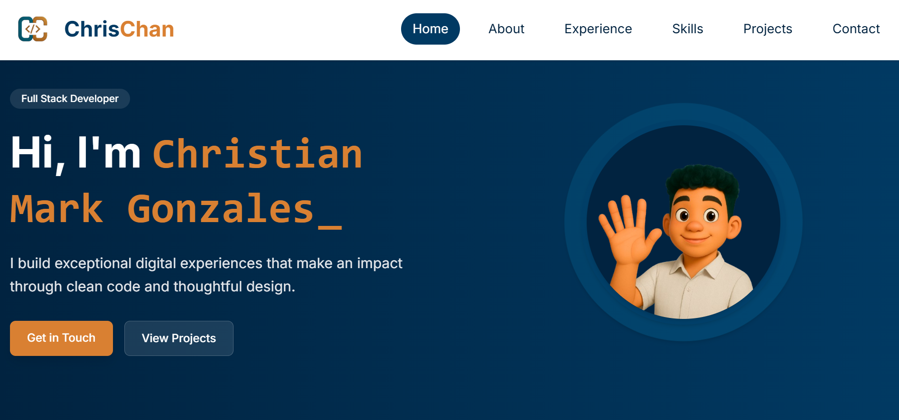

# Personal Portfolio – Christian Mark Gonzales


---

A modern, minimalistic personal portfolio website built with Vue 3, Vite, and Tailwind CSS.  
Showcasing my professional experience, skills, projects, and contact information — fully responsive and deployed on GitHub Pages.

🔗 **Live Site:** [https://cmarkgonzales.github.io/my-portfolio/](https://cmarkgonzales.github.io/my-portfolio/)

---

## 📸 Screenshot



---

## 📖 About

This portfolio serves as my personal website to highlight:

- A brief introduction about myself
- Professional experience
- Technical skills
- Featured projects
- Contact information for networking or job opportunities

The site is built using modern frontend technologies with a focus on simplicity, performance, and maintainability.

---

## 🛠️ Tech Stack

| Technology        | Description                                |
| ----------------- | ------------------------------------------ |
| [Vite](https://vitejs.dev/) | Lightning-fast development tool         |
| [Vue 3](https://vuejs.org/) | Progressive JavaScript framework         |
| [Tailwind CSS](https://tailwindcss.com/) | Utility-first CSS framework       |
| Composition API   | Modern Vue 3 state management              |
| Firebase Firestore| Dynamic content storage for navigation, etc. |
| GitHub Actions    | Custom workflow for CI/CD and Pages deploy |
| Font Awesome      | Icon system with tree-shakable plugin setup |

---

## ✨ Features

- 💡 Vue 3 Composition API
- ⚡ Vite ultra-fast dev server & build
- 🎨 Tailwind CSS responsive design
- 🔐 Firebase-based dynamic configuration (constants, links)
- 🔄 Reusable and generic components
- 💬 Modular form input handling
- 📄 PDF Resume integration
- 🚀 GitHub Actions CI/CD to GitHub Pages
- 📱 Fully responsive, mobile-first UI

---

## 📂 Project Structure

```bash
src/
  components/       # Core Vue components (Navbar, LoadingScreen, etc.)
  composables/      # Vue composables (e.g., useFirebaseConstants)
  generics/         # Reusable UI components (ExperienceCard, FormInput, etc.)
  plugins/          # Global plugins (e.g., fontawesome.js)
  store/            # Firebase-powered dynamic content
  utils/            # Helper functions
  App.vue           # Root component
  main.js           # App entry point

public/
  screenshots/      # Screenshots for README
  assets/           # Static assets
  resume.pdf        # Resume for download
